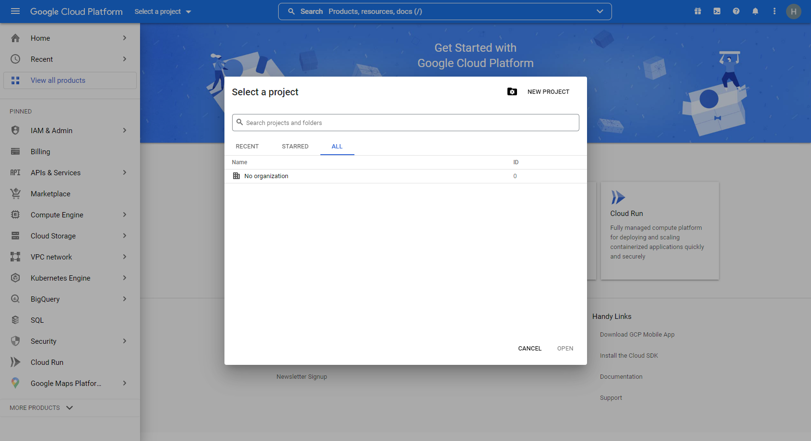
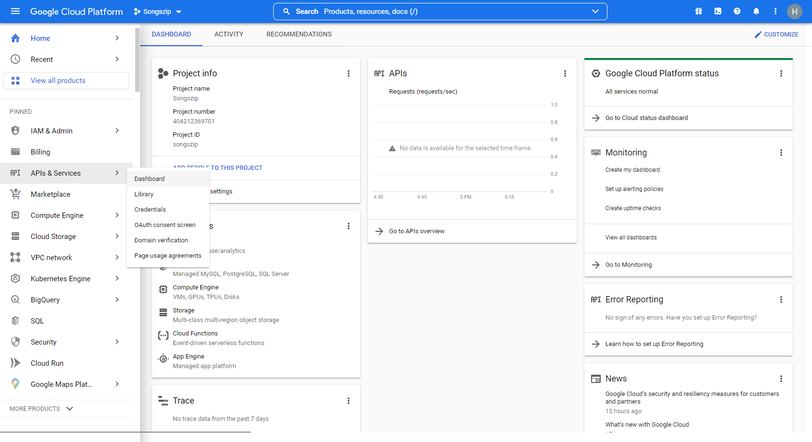
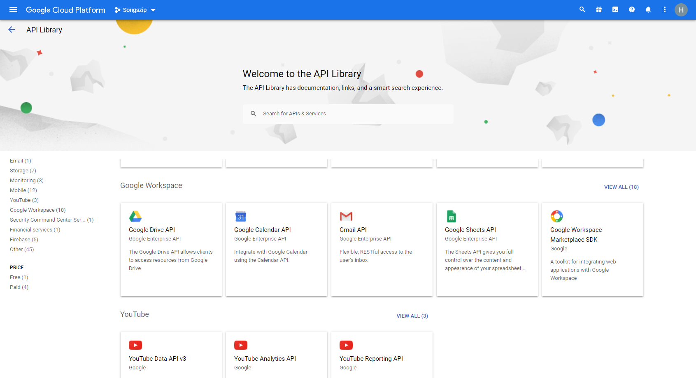
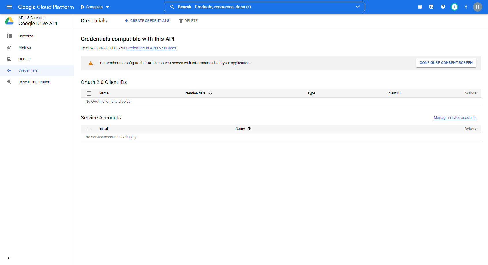
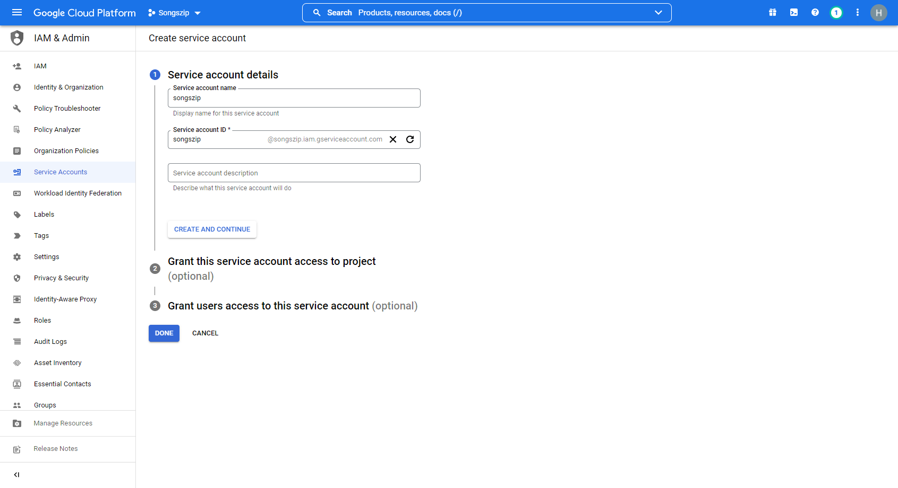
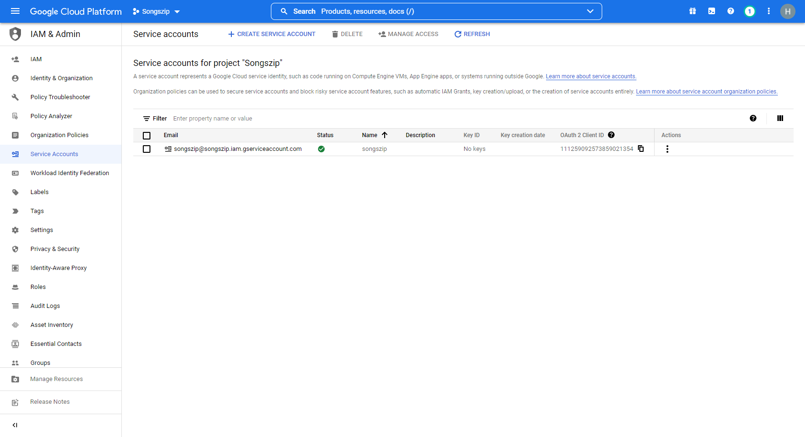
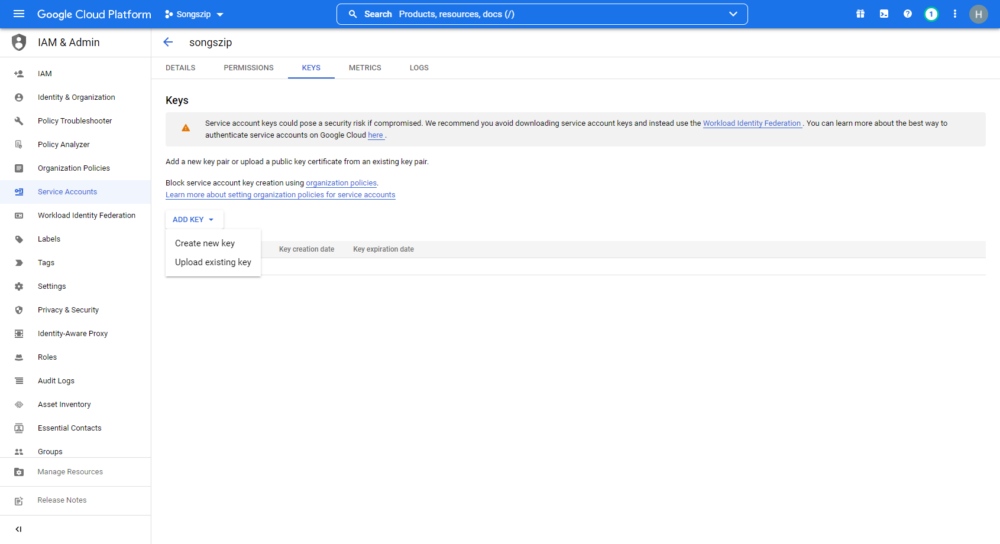
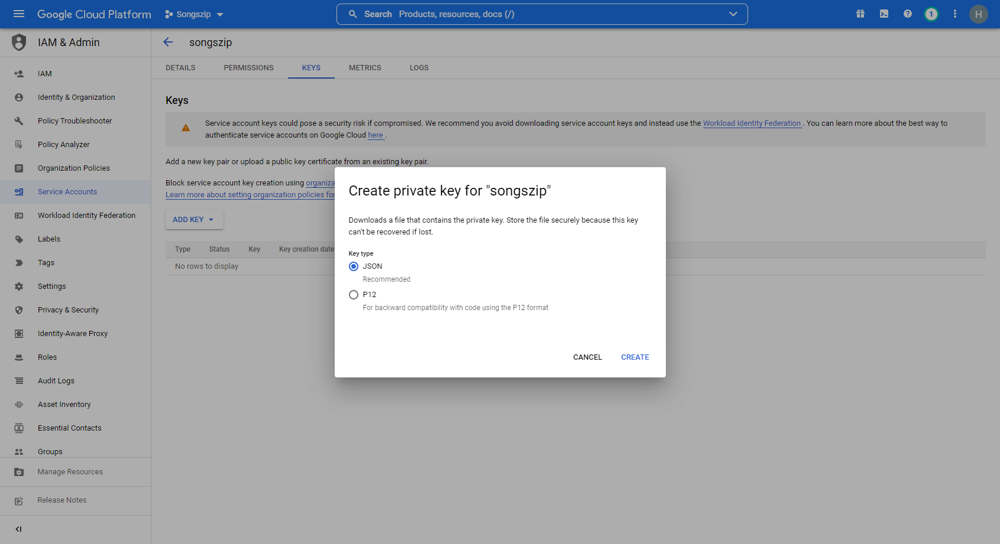

# osu_songszip_updater
Simple script to upload your osu! Songs to Google drive

The script creates a zip archive of your folder and uploads it to Google Drive

# Usage
- Download this repository
- Download python (don't forget to include it in path on installation)
- Install requirements. Open terminal (cmd) in the directory where you've downloaded the repository and execute the following command:
```
pip install -r requirements.txt
```

- ### Create and configure Google Cloud platform project
Go to the [Google Cloud platform website](https://console.cloud.google.com/) and sign in with your Google account

Click on "Select a project" and create a new project. You can use any name



Now click on "Select a project" again and select your new project

In the left menu select "APIs & Services" - Library



Find here Google Drive API and enable it for this project



On Google Drive API's page click on "Manage". Then select "Credentials" and click on "Manage service accounts"



Create a new service account. Choose any name for it. Click on "Create and continue" and then "Done"



Click on your new service account and then to go "Keys"



Create new key



Select JSON. Just download this file and move it to the repository's folder



Also, you will need this account's email, so, click on "Details" and copy it

- ### Configure Google Drive
  - Upload _any_ file to your Drive
  - Right-click on in and select "Share"
  - Paste the service account's email in this field and share
  - Now right-click on this file again and select "Get link". Copy part between `file/d/` and `/view?usp=sharing`. This is file id


- Fill in config.py with your data:
```python
credentials_file = "drive-api-339118-b3f563f580c6.json"
file_id = "1DNz4Cx3l0qaPmk_14iQN-OjgjbnywVh3"

filename = "Songs.zip"
path = r"C:\Program Files\osu!\Songs"
```

So, now the configuration is done. To run this script, open the terminal and execute the following command:
```
python main.py
```
